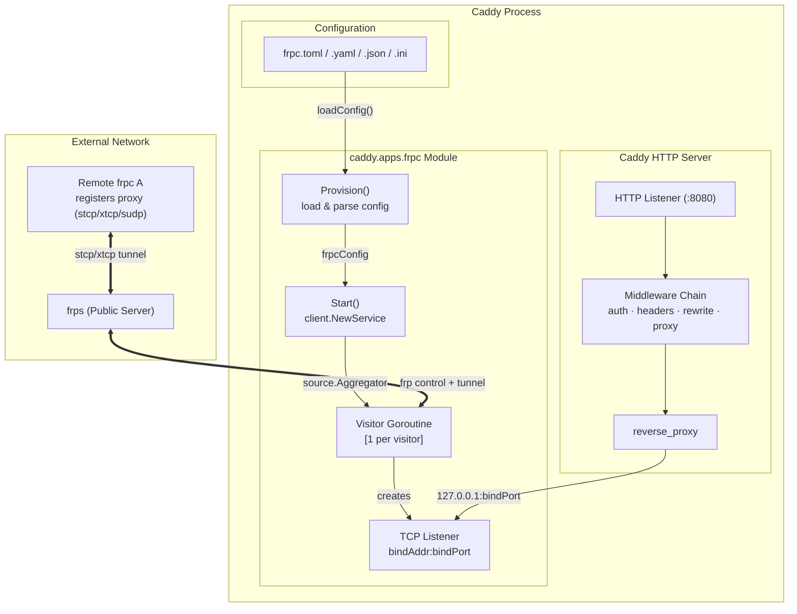
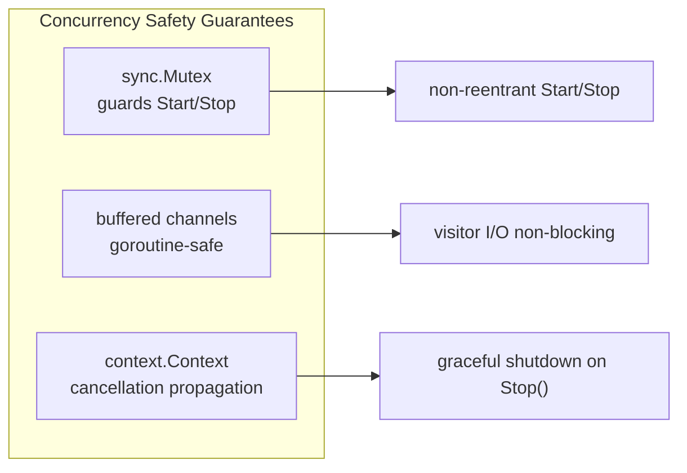

# caddy-frpc

[](https://go.dev)
[](https://caddyserver.com)
[](https://github.com/fatedier/frp)
[](LICENSE)
[](https://pkg.go.dev/github.com/hxgm/caddy-frpc)
[](https://github.com/hxgm/caddy-frpc/pulls)
[](https://github.com/Hoverhuang-er/caddy-frpc/actions/workflows/ci.yml)
[](https://github.com/Hoverhuang-er/caddy-frpc/pkgs/container/caddy-frpc)
[](https://github.com/Hoverhuang-er/caddy-frpc)

---

[中文版](README_zh.md) | [日本語版](README_jp.md)

Caddy app module that embeds [frpc](https://github.com/fatedier/frp) as a Go library and runs it in visitor mode. **AI Native** — 100% of the design was mined from local Mem0 operational memory and driven by Skills, an AI-native engineering workflow.

frpc visitors create local TCP listeners that tunnel connections through frps to services registered on remote frpc clients. Caddy manages the frpc lifecycle and can reverse-proxy to visitor listeners, applying its full middleware chain.

---

## Quick Start

### Option 1: Build with xcaddy (recommended)

[xcaddy](https://github.com/caddyserver/xcaddy) builds a Caddy binary with caddy-frpc compiled in from source. This gives you full control over which Caddy version and which caddy-frpc version to use. Use this when you want the latest code, need to pin specific versions, or are developing the module itself.

```bash
# Latest release
xcaddy build v2.11.4 --with github.com/Hoverhuang-er/caddy-frpc@latest

# Pin a specific version
xcaddy build v2.11.4 --with github.com/Hoverhuang-er/caddy-frpc@v0.1.2

# Local development copy
xcaddy build v2.11.4 --with github.com/Hoverhuang-er/caddy-frpc@.
```

Verify the plugin is embedded:
```bash
./caddy list-modules | grep frpc
# Output: caddy.apps.frpc
```

### Option 2: Download pre-built binary

Pre-built binaries are available from [GitHub Releases](https://github.com/Hoverhuang-er/caddy-frpc/releases) for Linux, macOS, and Windows on both AMD64 and ARM64. No build tools required.

```bash
# Linux AMD64
wget -O caddy https://github.com/Hoverhuang-er/caddy-frpc/releases/latest/download/caddy_wh_frpc_linux_amd64
chmod +x caddy

# macOS ARM64
wget -O caddy https://github.com/Hoverhuang-er/caddy-frpc/releases/latest/download/caddy_wh_frpc_darwin_arm64
chmod +x caddy
```

Verify:
```bash
./caddy list-modules | grep frpc
# Output: caddy.apps.frpc
```

### Option 3: Docker

```bash
docker pull ghcr.io/hoverhuang-er/caddy-frpc:latest

docker run -v ./frpc.toml:/etc/caddy/frpc.toml \
  -v ./Caddyfile:/etc/caddy/Caddyfile \
  ghcr.io/hoverhuang-er/caddy-frpc:latest
```

### Option 4: Kubernetes

Create a ConfigMap with your frpc and Caddy config, then deploy:

```yaml
apiVersion: v1
kind: ConfigMap
metadata:
  name: caddy-config
data:
  Caddyfile: |
    { frpc ./frpc.toml }
    :8080 { reverse_proxy 127.0.0.1:8000 }
  frpc.toml: |
    serverAddr = "frps.example.com"
    serverPort = 7000
    auth.token = "my-token"
    [[visitors]]
    name = "my-service"
    type = "stcp"
    serverName = "remote-service"
    secretKey = "my-secret"
    bindAddr = "127.0.0.1"
    bindPort = 8000
---
apiVersion: apps/v1
kind: Deployment
metadata:
  name: caddy-frpc
spec:
  replicas: 1
  selector:
    matchLabels: { app: caddy-frpc }
  template:
    metadata:
      labels: { app: caddy-frpc }
    spec:
      containers:
        - name: caddy
          image: ghcr.io/hoverhuang-er/caddy-frpc:latest
          ports:
            - containerPort: 8080
          volumeMounts:
            - name: config
              mountPath: /etc/caddy
      volumes:
        - name: config
          configMap:
            name: caddy-config
```


## Architecture



**Data flow:**
- Visitor establishes a control connection to frps at startup
- When a remote frpc A registers a matching proxy, the visitor creates a TCP listener on local `bindAddr:bindPort`
- Caddy's HTTP server reverse-proxies to the visitor's local listener
- Each visitor runs in its own goroutine; all channels are goroutine-safe

### Concurrency Model



- `sync.Mutex` protects shared state (`svr`, `cancel`) from concurrent `Start()`/`Stop()` calls
- Each visitor's channel buffers connections independently — no shared write lock in hot path
- `context.Context` cancellation propagates from Caddy's lifecycle to every visitor goroutine
- `atomic.Bool` (in frpcListener, removed but pattern proven) ensures idempotent close

## Supported Config Formats

The module accepts frpc config files in these formats:

| Format | Extension | Notes |
|--------|-----------|-------|
| TOML   | `.toml`   | frp v1 native format |
| YAML   | `.yaml` / `.yml` | |
| JSON   | `.json`   | |
| INI    | `.ini`    | Legacy format, deprecated by frp |

## Visitor Mode

This module operates in frpc **visitor** mode (STCP/XTCP/SUDP visitors). In this mode:

1. **frpc A** registers a proxy on frps (type = stcp, with secretKey)
2. **Caddy-frpc** (this module) configures a visitor that connects to frpc A's service through frps
3. The visitor creates a local TCP listener on `bindAddr:bindPort`
4. Caddy's HTTP server can reverse-proxy to that local port

The module does **not** support frpc proxy mode (where frpc receives work connections from frps). Only `[[visitors]]` from the config file are processed; `[[proxies]]` are logged and skipped.

## Usage

### 0. Build

```bash
xcaddy build v2.11.4 --with github.com/hxgm/caddy-frpc
```

This produces a `caddy` binary with the frpc module embedded.

### 1. Create your frpc config

Create a standard frpc configuration file. Only `[[visitors]]` are processed; `[[proxies]]` are ignored.

**TOML (recommended):**

```toml
# frpc.toml
serverAddr = "frps.example.com"
serverPort = 7000
auth.token = "my-token"

[[visitors]]
name = "my-service"
type = "stcp"
serverName = "remote-service"
secretKey = "my-secret"
bindAddr = "127.0.0.1"
bindPort = 8000
```

**INI (legacy):**

```ini
; frpc.ini
[common]
server_addr = frps.example.com
server_port = 7000
token = my-token

[my-service]
type = stcp
role = visitor
server_name = remote-service
sk = my-secret
bind_addr = 127.0.0.1
bind_port = 8000
```

**YAML or JSON** are also supported. See `examples/` for all variants.

### 2. Start Caddy

You have **three ways** to start. Pick the one that fits your setup.

#### Option A: Caddyfile (recommended)

The Caddyfile references your frpc config file. Caddyfile IS required here.

```caddyfile
# Caddyfile
{
    # Tell Caddy to load the frpc module with your frpc.toml
    frpc ./frpc.toml
}

# HTTP server on port 8080 proxies to the visitor tunnel
:8080 {
    reverse_proxy 127.0.0.1:8000
}
```

```bash
./caddy run --config Caddyfile
```

#### Option B: Caddy JSON (inline frpc config)

Embed the frpc config directly in Caddy's JSON config, no separate frpc.toml needed.

```json
{
  "apps": {
    "frpc": {
      "config": "serverAddr = \"frps.example.com\"\nserverPort = 7000\n\n[[visitors]]\nname = \"my-service\"\ntype = \"stcp\"\nserverName = \"remote-service\"\nsecretKey = \"my-secret\"\nbindAddr = \"127.0.0.1\"\nbindPort = 8000"
    },
    "http": {
      "servers": {
        "srv0": {
          "listen": [":8080"],
          "routes": [
            {
              "handle": [{
                "handler": "reverse_proxy",
                "upstreams": [{"dial": "127.0.0.1:8000"}]
              }]
            }
          ]
        }
      }
    }
  }
}
```

```bash
./caddy run --config caddy.json
```

#### Option C: Caddyfile with block syntax

```caddyfile
# Caddyfile
{
    frpc {
        config ./frpc.toml
    }
}

:8080 {
    reverse_proxy 127.0.0.1:8000
}
```

#### Key point: `--config` is always a Caddy config (Caddyfile or JSON), NOT the frpc.toml

| You might think | What actually happens |
|----------------|----------------------|
| `./caddy run --config frpc.toml` | Caddy tries to parse frpc.toml as a Caddyfile. It will fail. |
| `./caddy run --config Caddyfile` | Correct. Caddy reads Caddyfile which references frpc.toml. |


## Prerequisites

- A running [frps](https://github.com/fatedier/frp) server
- At least one remote frpc client registered with a stcp/xtcp/sudp proxy
- [xcaddy](https://github.com/caddyserver/xcaddy) for building
- Go 1.26+

## Configuration Reference

See the [frp documentation](https://github.com/fatedier/frp#readme) for complete configuration options. Key visitor fields:

| Field | Type | Description |
|-------|------|-------------|
| `name` | string | Visitor name |
| `type` | string | `stcp`, `xtcp`, or `sudp` |
| `serverName` | string | Target proxy name on frps |
| `secretKey` | string | Shared secret matching the target proxy |
| `bindAddr` | string | Local bind address (default: 127.0.0.1) |
| `bindPort` | int | Local bind port |

Common fields in the top-level config:

| Field | Type | Default | Description |
|-------|------|---------|-------------|
| `serverAddr` | string | `0.0.0.0` | frps server address |
| `serverPort` | int | `7000` | frps server port |
| `auth.token` | string | | Authentication token |
| `transport.protocol` | string | `tcp` | `tcp`, `kcp`, `quic`, `websocket` |

## Testing

Example configurations are tested against the module's config loader. Run:

```bash
go test -v -count=1 ./...
```

The test suite verifies:
- TOML config parsing (examples/frpc.toml)
- INI config parsing (examples/frpc.ini)
- Caddyfile unmarshaling (examples/Caddyfile)
- Module registration and interface compliance
- Inline config via Caddy JSON `config` field
- YAML and JSON config format support

## Examples

See `examples/` directory for complete, tested sample configurations.

## License

Apache 2.0
