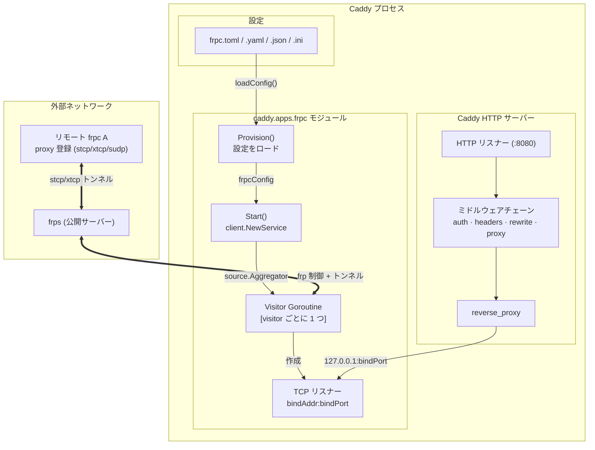
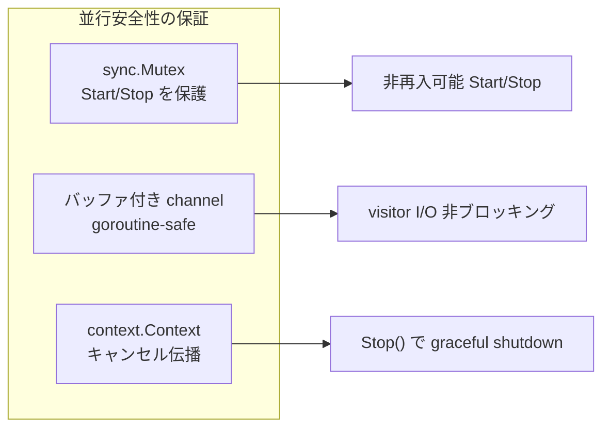

# caddy-frpc

[](https://go.dev)
[](https://caddyserver.com)
[](https://github.com/fatedier/frp)
[](LICENSE)
[](https://pkg.go.dev/github.com/hxgm/caddy-frpc)
[](https://github.com/hxgm/caddy-frpc/pulls)
[](https://github.com/Hoverhuang-er/caddy-frpc/actions/workflows/ci.yml)

[English](README.md) | [中文版](README_zh.md)

## アーキテクチャ



**データフロー：**
- Visitor は起動時に frps との制御接続を確立
- リモート frpc A が一致する proxy を登録すると、visitor はローカル `bindAddr:bindPort` に TCP リスナーを作成
- Caddy HTTP サーバーが visitor のローカルリスナーにリバースプロキシ
- 各 visitor は独立した goroutine で動作；すべてのチャネルは goroutine-safe

### 並行安全性モデル



- `sync.Mutex` が共有状態 (`svr`, `cancel`) を `Start()`/`Stop()` の同時呼び出しから保護
- 各 visitor のチャネルは独立して接続をバッファリング—ホットパスに共有書き込みロックなし
- `context.Context` のキャンセルが Caddy のライフサイクルから全 visitor goroutine に伝播

## サポートする設定形式

モジュールは以下の形式の frpc 設定ファイルを受け入れます：

| 形式 | 拡張子 | 備考 |
|------|--------|------|
| TOML | `.toml` | frp v1 ネイティブ形式（推奨） |
| YAML | `.yaml` / `.yml` | |
| JSON | `.json` | |
| INI | `.ini` | レガシー形式、frp により非推奨 |

## 使い方

### 0. ビルド

```bash
xcaddy build v2.11.4 --with github.com/hxgm/caddy-frpc
```

frpc モジュールが組み込まれた `caddy` バイナリが生成されます。

### 1. frpc 設定ファイルを作成

標準的な frpc 設定ファイルを作成します。`[[visitors]]` のみが処理され、`[[proxies]]` は無視されます。

**TOML（推奨）：**

```toml
# frpc.toml
serverAddr = "frps.example.com"
serverPort = 7000
auth.token = "my-token"

[[visitors]]
name = "my-service"
type = "stcp"
serverName = "remote-service"
secretKey = "my-secret"
bindAddr = "127.0.0.1"
bindPort = 8000
```

**INI（レガシー形式）：**

```ini
; frpc.ini
[common]
server_addr = frps.example.com
server_port = 7000
token = my-token

[my-service]
type = stcp
role = visitor
server_name = remote-service
sk = my-secret
bind_addr = 127.0.0.1
bind_port = 8000
```

**YAML と JSON** 形式もサポートしています。詳細は `examples/` ディレクトリを参照してください。

### 2. Caddy を起動

起動方法は **3 通り**あります。環境に合わせて選択してください。

#### 方法 A：Caddyfile（推奨）

Caddyfile が frpc 設定ファイルを参照します。ここでは Caddyfile が必須です。

```caddyfile
# Caddyfile
{
    # Caddy に frpc モジュールを読み込ませ、frpc.toml を指定
    frpc ./frpc.toml
}

# 8080 番ポートの HTTP サーバーが visitor トンネルにプロキシ
:8080 {
    reverse_proxy 127.0.0.1:8000
}
```

```bash
./caddy run --config Caddyfile
```

#### 方法 B：Caddy JSON（frpc 設定をインラインで記述）

frpc 設定を Caddy の JSON 設定に直接埋め込みます。別途 frpc.toml は不要です。

```json
{
  "apps": {
    "frpc": {
      "config": "serverAddr = \"frps.example.com\"\nserverPort = 7000\n\n[[visitors]]\nname = \"my-service\"\ntype = \"stcp\"\nserverName = \"remote-service\"\nsecretKey = \"my-secret\"\nbindAddr = \"127.0.0.1\"\nbindPort = 8000"
    },
    "http": {
      "servers": {
        "srv0": {
          "listen": [":8080"],
          "routes": [
            {
              "handle": [{
                "handler": "reverse_proxy",
                "upstreams": [{"dial": "127.0.0.1:8000"}]
              }]
            }
          ]
        }
      }
    }
  }
}
```

```bash
./caddy run --config caddy.json
```

#### 方法 C：Caddyfile ブロック構文

```caddyfile
# Caddyfile
{
    frpc {
        config ./frpc.toml
    }
}

:8080 {
    reverse_proxy 127.0.0.1:8000
}
```

#### 重要なポイント：`--config` は常に Caddy 設定（Caddyfile または JSON）を指定します。frpc.toml ではありません。

| こう思うかもしれません | 実際の動作 |
|------------------------|-----------|
| `./caddy run --config frpc.toml` | Caddy が frpc.toml を Caddyfile として解析しようとし、失敗します |
| `./caddy run --config Caddyfile` | 正しい使い方。Caddy が Caddyfile を読み込み、Caddyfile が frpc.toml を参照します |

## Visitor モード

本モジュールは frpc **visitor** モード（STCP/XTCP/SUDP visitor）で動作します。

1. **frpc A** が frps にプロキシを登録します（type = stcp、secretKey 付き）
2. **Caddy-frpc**（本モジュール）が visitor を設定し、frps 経由で frpc A のサービスに接続します
3. visitor が `bindAddr:bindPort` にローカル TCP リスナーを作成します
4. Caddy の HTTP サーバーがそのローカルポートにリバースプロキシします

本モジュールは frpc プロキシモード（frpc が frps から作業接続を受信する方式）をサポートしません。設定ファイル内の `[[visitors]]` のみが処理され、`[[proxies]]` は警告を記録してスキップされます。

## 前提条件

- 稼働中の [frps](https://github.com/fatedier/frp) サーバー
- stcp/xtcp/sudp プロキシを登録したリモート frpc クライアントが少なくとも 1 つ
- [xcaddy](https://github.com/caddyserver/xcaddy)（ビルド用）
- Go 1.26+

## 設定リファレンス

完全な設定オプションは [frp ドキュメント](https://github.com/fatedier/frp#readme) を参照してください。主な visitor フィールド：

| フィールド | 型 | 説明 |
|-----------|-----|------|
| `name` | string | Visitor 名 |
| `type` | string | `stcp`、`xtcp`、または `sudp` |
| `serverName` | string | frps 上のターゲットプロキシ名 |
| `secretKey` | string | ターゲットプロキシと一致する共有秘密鍵 |
| `bindAddr` | string | ローカルバインドアドレス（デフォルト 127.0.0.1） |
| `bindPort` | int | ローカルバインドポート |

トップレベル設定の共通フィールド：

| フィールド | 型 | デフォルト | 説明 |
|-----------|-----|-----------|------|
| `serverAddr` | string | `0.0.0.0` | frps サーバーアドレス |
| `serverPort` | int | `7000` | frps サーバーポート |
| `auth.token` | string | | 認証トークン |
| `transport.protocol` | string | `tcp` | `tcp`、`kcp`、`quic`、`websocket` |

## テスト

サンプル設定はモジュールの設定ローダーでテストされています。実行：

```bash
go test -v -count=1 ./...
```

テストスイートは以下を検証します：
- TOML 設定の解析（examples/frpc.toml）
- INI 設定の解析（examples/frpc.ini）
- Caddyfile の解析（examples/Caddyfile）
- モジュール登録とインターフェース準拠
- Caddy JSON `config` フィールドによるインライン設定
- YAML および JSON 設定形式のサポート

## サンプル

完全なテスト済みサンプル設定は `examples/` ディレクトリを参照してください。

## ライセンス

Apache 2.0
