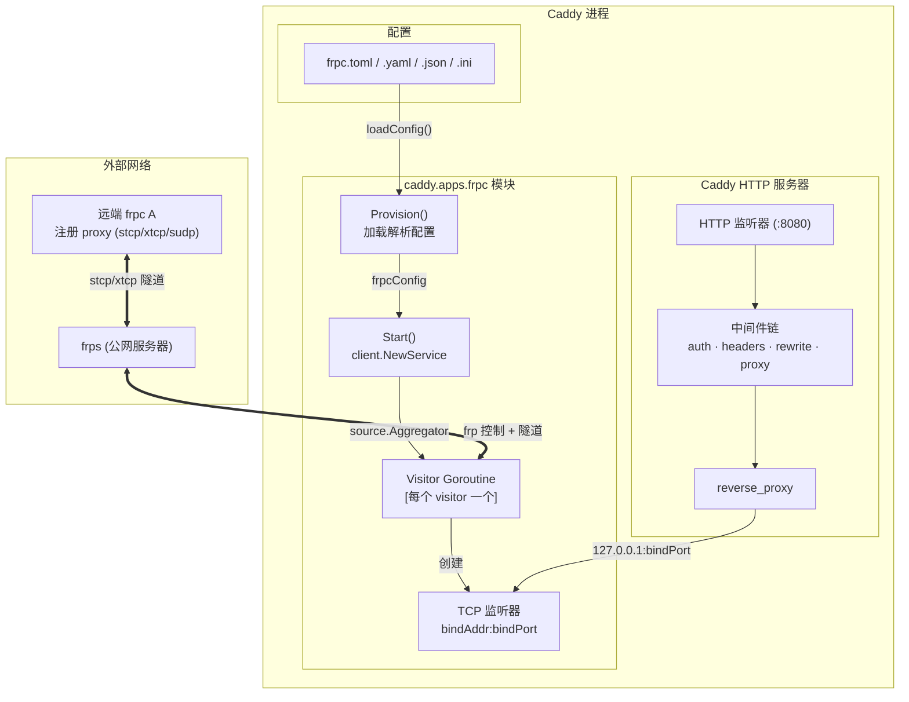
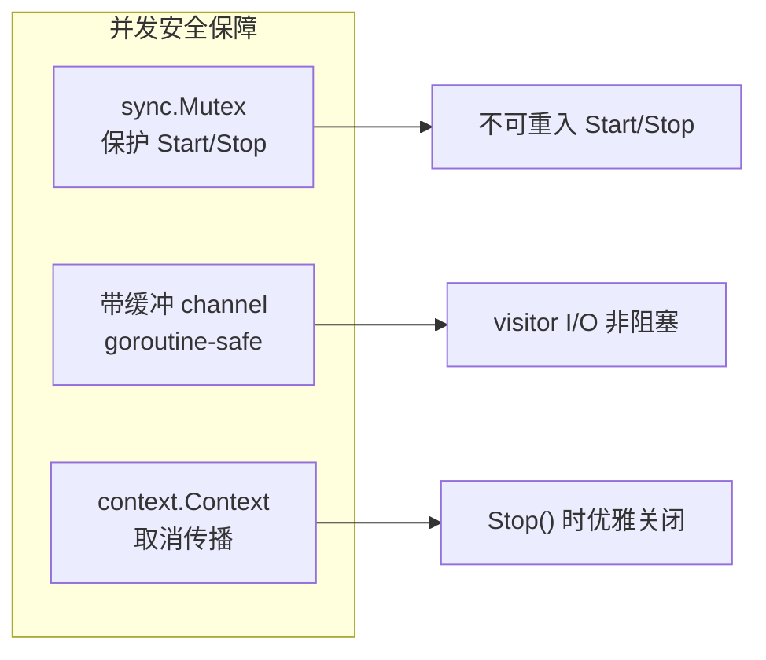

# caddy-frpc

[](https://go.dev)
[](https://caddyserver.com)
[](https://github.com/fatedier/frp)
[](LICENSE)
[](https://pkg.go.dev/github.com/hxgm/caddy-frpc)
[](https://github.com/hxgm/caddy-frpc/pulls)
[](https://github.com/Hoverhuang-er/caddy-frpc/actions/workflows/ci.yml)
[](https://github.com/Hoverhuang-er/caddy-frpc/pkgs/container/caddy-frpc)

[English](README.md) | [日本語版](README_jp.md)

## 快速开始

### 下载二进制

从 [GitHub Releases](https://github.com/Hoverhuang-er/caddy-frpc/releases) 下载最新的编译好的 caddy 二进制：

```bash
# Linux AMD64
wget -O caddy https://github.com/Hoverhuang-er/caddy-frpc/releases/latest/download/caddy_wh_frpc_linux_amd64
chmod +x caddy

# macOS ARM64 (Apple Silicon)
wget -O caddy https://github.com/Hoverhuang-er/caddy-frpc/releases/latest/download/caddy_wh_frpc_darwin_arm64
chmod +x caddy
```

验证插件已嵌入：
```bash
./caddy list-modules | grep frpc
# 输出: caddy.apps.frpc
```

### Docker

```bash
docker pull ghcr.io/hoverhuang-er/caddy-frpc:latest

docker run -v ./frpc.toml:/etc/caddy/frpc.toml \
  -v ./Caddyfile:/etc/caddy/Caddyfile \
  ghcr.io/hoverhuang-er/caddy-frpc:latest
```

### Kubernetes

创建 ConfigMap 存放 frpc 和 Caddy 配置，然后部署：

```yaml
apiVersion: v1
kind: ConfigMap
metadata:
  name: caddy-config
data:
  Caddyfile: |
    { frpc ./frpc.toml }
    :8080 { reverse_proxy 127.0.0.1:8000 }
  frpc.toml: |
    serverAddr = "frps.example.com"
    serverPort = 7000
    auth.token = "my-token"
    [[visitors]]
    name = "my-service"
    type = "stcp"
    serverName = "remote-service"
    secretKey = "my-secret"
    bindAddr = "127.0.0.1"
    bindPort = 8000
---
apiVersion: apps/v1
kind: Deployment
metadata:
  name: caddy-frpc
spec:
  replicas: 1
  selector:
    matchLabels: { app: caddy-frpc }
  template:
    metadata:
      labels: { app: caddy-frpc }
    spec:
      containers:
        - name: caddy
          image: ghcr.io/hoverhuang-er/caddy-frpc:latest
          ports:
            - containerPort: 8080
          volumeMounts:
            - name: config
              mountPath: /etc/caddy
      volumes:
        - name: config
          configMap:
            name: caddy-config
## 架构



**数据流：**
- Visitor 启动时与 frps 建立控制连接
- 远端 frpc A 注册了匹配的 proxy 后，visitor 在本地 `bindAddr:bindPort` 创建 TCP 监听器
- Caddy HTTP 服务器通过反向代理将请求转发到 visitor 的本地监听器
- 每个 visitor 运行在独立 goroutine 中；所有 channel 是 goroutine-safe 的

### 并发安全模型



- `sync.Mutex` 保护共享状态 (`svr`, `cancel`) 免受 `Start()`/`Stop()` 并发调用
- 每个 visitor 的 channel 独立缓冲连接——热路径上无共享写锁
- `context.Context` 取消从 Caddy 生命周期传播到每个 visitor goroutine

## 支持的配置格式

模块接受以下格式的 frpc 配置文件：

| 格式 | 扩展名 | 说明 |
|------|--------|------|
| TOML | `.toml` | frp v1 原生格式（推荐） |
| YAML | `.yaml` / `.yml` | |
| JSON | `.json` | |
| INI | `.ini` | 旧格式，已被 frp 弃用 |
## 使用方法

### 0. 构建

```bash
xcaddy build v2.11.4 --with github.com/hxgm/caddy-frpc
```

生成一个嵌入了 frpc 模块的 `caddy` 二进制文件。

### 1. 创建 frpc 配置文件

创建标准的 frpc 配置。只有 `[[visitors]]` 会被处理，`[[proxies]]` 会被忽略。

**TOML（推荐）：**

```toml
# frpc.toml
serverAddr = "frps.example.com"
serverPort = 7000
auth.token = "my-token"

[[visitors]]
name = "my-service"
type = "stcp"
serverName = "remote-service"
secretKey = "my-secret"
bindAddr = "127.0.0.1"
bindPort = 8000
```

**INI（旧格式）：**

```ini
; frpc.ini
[common]
server_addr = frps.example.com
server_port = 7000
token = my-token

[my-service]
type = stcp
role = visitor
server_name = remote-service
sk = my-secret
bind_addr = 127.0.0.1
bind_port = 8000
```

**YAML 和 JSON** 格式同样支持。详见 `examples/` 目录。

### 2. 启动 Caddy

有三种启动方式，任选其一。

#### 方式 A：Caddyfile（推荐）

Caddyfile 引用你的 frpc 配置文件。这里 Caddyfile 是必需的。

```caddyfile
# Caddyfile
{
    # 告诉 Caddy 加载 frpc 模块并指向 frpc.toml
    frpc ./frpc.toml
}

# 8080 端口的 HTTP 服务器代理到 visitor 隧道
:8080 {
    reverse_proxy 127.0.0.1:8000
}
```

```bash
./caddy run --config Caddyfile
```

#### 方式 B：Caddy JSON（内联 frpc 配置）

将 frpc 配置直接嵌入到 Caddy 的 JSON 配置中，无需单独的 frpc.toml。

```json
{
  "apps": {
    "frpc": {
      "config": "serverAddr = \"frps.example.com\"\nserverPort = 7000\n\n[[visitors]]\nname = \"my-service\"\ntype = \"stcp\"\nserverName = \"remote-service\"\nsecretKey = \"my-secret\"\nbindAddr = \"127.0.0.1\"\nbindPort = 8000"
    },
    "http": {
      "servers": {
        "srv0": {
          "listen": [":8080"],
          "routes": [
            {
              "handle": [{
                "handler": "reverse_proxy",
                "upstreams": [{"dial": "127.0.0.1:8000"}]
              }]
            }
          ]
        }
      }
    }
  }
}
```

```bash
./caddy run --config caddy.json
```

#### 方式 C：Caddyfile 块语法

```caddyfile
# Caddyfile
{
    frpc {
        config ./frpc.toml
    }
}

:8080 {
    reverse_proxy 127.0.0.1:8000
}
```

#### 关键点：`--config` 指定的始终是 Caddy 配置（Caddyfile 或 JSON），而非 frpc.toml

| 你可能这样想 | 实际发生的情况 |
|-------------|---------------|
| `./caddy run --config frpc.toml` | Caddy 试图把 frpc.toml 当作 Caddyfile 解析，会失败 |
| `./caddy run --config Caddyfile` | 正确。Caddy 读取 Caddyfile，Caddyfile 引用 frpc.toml |

## Visitor 模式

本模块运行在 frpc **visitor** 模式（STCP/XTCP/SUDP visitor）。流程如下：

1. **frpc A** 在 frps 上注册一个代理（type = stcp，含 secretKey）
2. **Caddy-frpc**（本模块）配置一个 visitor，通过 frps 连接到 frpc A 的服务
3. visitor 在 `bindAddr:bindPort` 创建本地 TCP 监听器
4. Caddy 的 HTTP 服务器反向代理到该本地端口

本模块不支持 frpc proxy 模式（即 frpc 从 frps 接收工作连接）。仅处理 `[[visitors]]`，`[[proxies]]` 会被记录警告并跳过。

## 前置条件

- 运行中的 [frps](https://github.com/fatedier/frp) 服务器
- 至少一个远程 frpc 客户端注册了 stcp/xtcp/sudp 代理
- [xcaddy](https://github.com/caddyserver/xcaddy) 用于构建
- Go 1.26+

## 配置参考

完整配置选项请参见 [frp 文档](https://github.com/fatedier/frp#readme)。主要 visitor 字段：

| 字段 | 类型 | 说明 |
|------|------|------|
| `name` | string | Visitor 名称 |
| `type` | string | `stcp`、`xtcp` 或 `sudp` |
| `serverName` | string | frps 上的目标代理名称 |
| `secretKey` | string | 与目标代理匹配的共享密钥 |
| `bindAddr` | string | 本地绑定地址（默认 127.0.0.1） |
| `bindPort` | int | 本地绑定端口 |

顶层配置的常用字段：

| 字段 | 类型 | 默认值 | 说明 |
|------|------|--------|------|
| `serverAddr` | string | `0.0.0.0` | frps 服务器地址 |
| `serverPort` | int | `7000` | frps 服务器端口 |
| `auth.token` | string | | 认证令牌 |
| `transport.protocol` | string | `tcp` | `tcp`、`kcp`、`quic`、`websocket` |

## 测试

示例配置通过模块配置加载器测试。运行：

```bash
go test -v -count=1 ./...
```

测试套件验证：
- TOML 配置解析（examples/frpc.toml）
- INI 配置解析（examples/frpc.ini）
- Caddyfile 解析（examples/Caddyfile）
- 模块注册与接口合规性
- 通过 Caddy JSON `config` 字段内联配置
- YAML 和 JSON 配置格式支持

## 示例

详见 `examples/` 目录下的完整测试示例配置。

## 许可证

Apache 2.0
